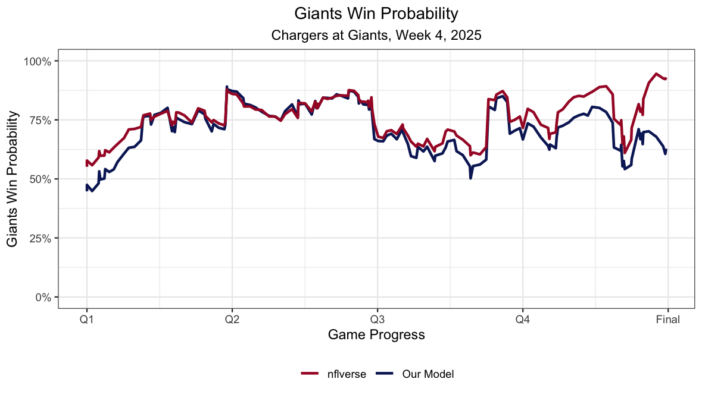

# NFL Win Probability Model

An NFL win probability model built in R using play-by-play data, logistic regression, out-of-sample validation, and comparison with nflverse win probability estimates.

## Project Overview

This project builds a simplified in-game NFL win probability model using play-by-play data. The goal was to estimate a team's probability of winning based on the current game situation and evaluate how a relatively simple statistical model compares with an established win probability model.

The model is trained on NFL regular season play-by-play data from 2021 through 2023, evaluated on unseen 2024 data, and then applied to the 2025 Week 4 game between the New York Giants and Los Angeles Chargers as a case study.

## Data

NFL play-by-play data is pulled directly into R using the `nflreadr` package.

Only regulation plays with a defined possession team, down, distance, field position, time remaining, and score differential are included in the modeling dataset.

Using separate seasons for training and testing allows the model to be evaluated on games that were not used to estimate its coefficients.

## Win Probability Model

A logistic regression model estimates the probability that the team currently possessing the ball will win the game.

The model uses five situational variables:

- Down
- Yards to go
- Field position
- Game seconds remaining
- Score differential

The fitted model shows that larger score advantages are associated with higher win probability, while later downs, longer distances to a first down, and greater distance from the opponent's end zone are associated with lower win probability.

## Out-of-Sample Evaluation

The model is trained using the 2021 through 2023 NFL seasons and evaluated on the 2024 regular season.

On the unseen 2024 data, the model produced:

- Brier Score: **0.164**
- Classification Accuracy: **73.9%**

The Brier Score evaluates the accuracy of the probability estimates rather than only whether the model selected the eventual winner.

## 2025 Giants vs. Chargers Case Study

The model is applied to the Giants vs. Chargers game from Week 4 of the 2025 season.

For each qualifying play, the model generates a Giants win probability. These estimates are compared with the win probability values provided by nflverse.

The two models produced:

- Mean Absolute Error: **5.07 percentage points**
- Root Mean Squared Error: **7.53 percentage points**
- Correlation: **0.831**

The strong positive correlation shows that the simplified model captures much of the same overall movement in win probability as nflverse, while differences between the models remain throughout the game.

## Win Probability Swings

The analysis also calculates the change in win probability between plays to identify the moments with the largest impact on the Giants' estimated chances of winning.

The largest change identified by the model was approximately **22.5 percentage points**, demonstrating how individual game events can create substantial changes in expected outcome.

## Model Limitations

This model is intentionally simplified and uses only five game-state variables. It does not account for factors such as team strength, timeouts remaining, quarterback quality, pregame expectations, or other contextual information that can influence win probability.

The goal of the project is not to reproduce the full nflverse model, but to build, validate, and evaluate an interpretable win probability model using a limited set of game-state information.

## Tools Used

- R
- tidyverse
- nflreadr
- broom
- ggplot2
- Logistic regression
- Predictive modeling
- Out-of-sample validation
- Model evaluation
- Data visualization

## Files

- `nfl_win_probability.R` — Data collection, model development, validation, game analysis, and visualization
- `giants-win-probability.png` — Comparison of model and nflverse win probability throughout the Giants vs. Chargers game
